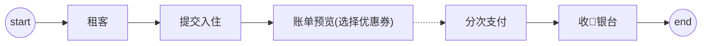
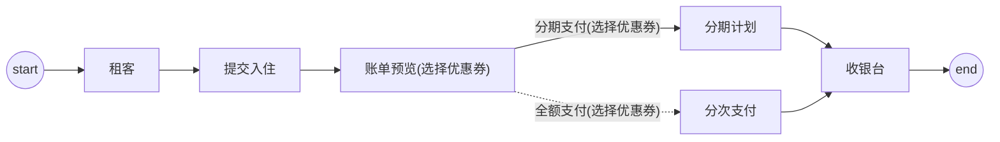

# 分期支付流程

## 「房号直签」场景
### 门店不支持无分期

```mermaid

graph LR;
s0((start))-->租客
租客 -->A["提交入住"]
A --> B["账单预览(选择优惠券)"]
B .-> C["分次支付"]
C --> D["收银台"]
D["收银台"]-->E0(("end"))

```

### 门店支持分期

```mermaid

graph LR;
s0((start))-->租客
租客 -->A["提交入住"]
A --> B["账单预览(选择优惠券)"]
B --"分期支付(选择优惠券)"-->C1["分期计划"]
C1 -->D1["收银台"]
D1--> E0(("end"))

B -."全额支付(选择优惠券)".->C2["分次支付"]
C2-->D1

```