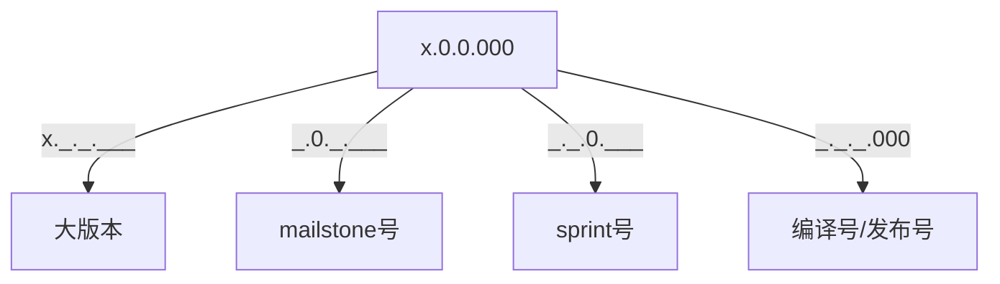

# 版本管理
为了方便相关人员对于需求推进、问题描述、以及影响范围等基于一个共同约定进行描述，拟定如下版本约定。

## 预期版本号

x.0.0.000

## 现有情况
### 环境
1. DEV
2. TEST
3. BAT
4. PRE
5. PROD

### 产品 & 版本
1. 乐乎公寓APP
    * android：3.0.4
    * ios：3.0.4
2. 公寓管家APP
    * android：3.0.3
    * iOS：3.0.3
3. 公寓管家web端：3.0.35
4. 公寓管家客户端：3.0.13
5. 找房小程序：2.1.9
6. 电商小程序：2.0.9
7. 活动小程序：2.1.7
8. 官网（没有版本）